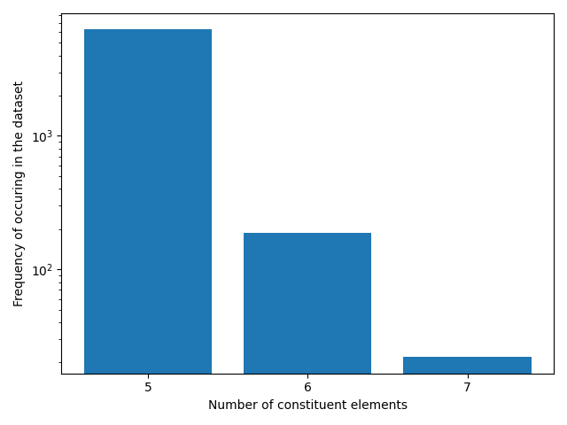
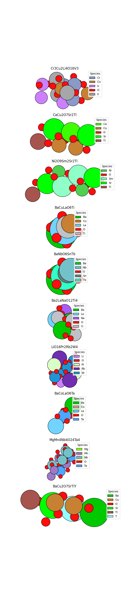
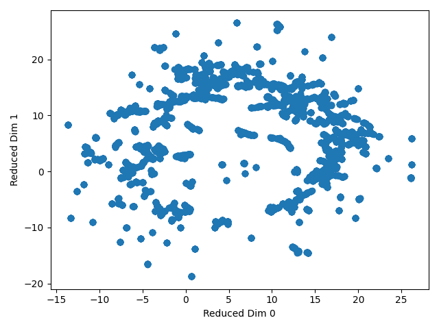
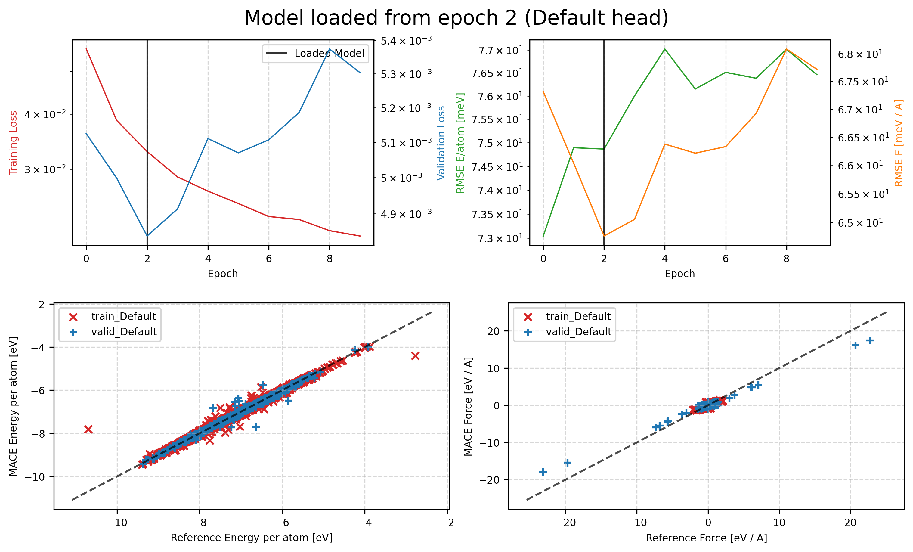
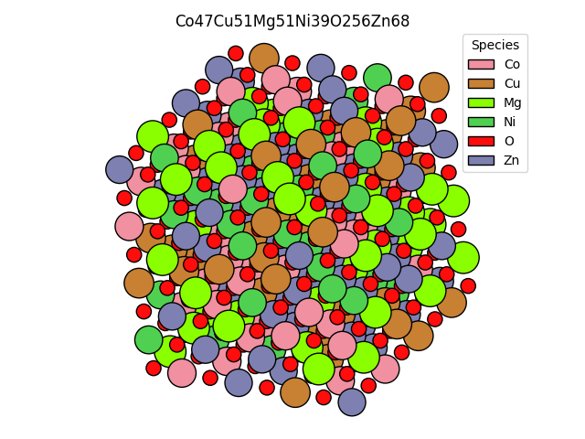

# Finetuning ML Potentials for relaxing high entropy oxides

## Project Overview

Mini-project for application to Dunia Internship - Steffen Wedig

In this mini-project, we finetune a machine learning potential (MACE-MP-0) for relaxation of high entropy oxides (HEOs). Finding stable/ low-energy geometries is important for

- characterising the properties of the bulk material (eg. phonon accuracy, defect energies, )
- determining surface properties (adsorption energies, catalytic activities)

We take three steps to tackle this task:

1. Curate a small dataset of high entropy oxides.
2. Finetune a MACE-MP-0 model on energies and forces
3. Run relaxation starting from randomly substituted crystals


### Dataset Curation

We collect our training dataset from the [LeMaterials Dataset](https://huggingface.co/datasets/LeMaterial/LeMat-Bulk) compiled by Entalpic, which is a combination of QMOD, Alexandria, and the Materials Project.

Simple Definition of HEOs:

- Contains Oxygen,
- Five or more elements,
- All non-oxygen elements are metals

Also filter out data samples out which do not contain forces

Could possibly add more filters:

- Configurational entropy higher then 1.5 R
- Equimolarity of constituent cations
- Remove expensive cations (noble metals e.g. platinum)

We visualize elemental distribution, UMAP projections, and some exemplary structures.

Note that a common definition of high entropy oxides include five different elements in the cations. We relax this definition to five elements in total (i.e. four cations + oxygen) to expand the training set, and argue that structures with four different cationic species also contains valueable information on atomic environments for structures with even larger compositional diversity.

### Finetuning

Finetune MACE-MP-0 using the naive finetuning protocol from the mace torch package, with the default parameters without any kind of hyperparameter optimization/

We essentially ignore catastrophic forgetting, and forego replay finetuning, because replaying the original training data drastically increases the computational cost of finetuning. Further, the LeMaterials dataset contains relevant mp materials anyways, which would be contained in the replay data as well. 

### Relaxation/Evaluation

Compare the energy/force RMSEs for finetuned model

In-distribution eval task: Take the DFT relaxed structures, rattle and relax with MLIP and check the root-mean-square distance (RMSD)/energy difference to the reference.

Out-of-distribution eval task: Start from random substituted parent crystals and relax, and check which model reaches lower energies. However, without performing further DFT, we can't really validate which model  

Compare rate of geometry optimization convergence for both models.

## Installation

Clone this repo, create a python 3.10 env and install required packages via pip

```
git clone git@github.com:steffen-wedig/heo_relax.git
conda create -n heo_relax python==3.10.0
conda activate heo_relax
cd heo_relax
pip install .
```

Create the dataset in directory DATA_DIR by running
```
python scripts/load_data_from_lemat.py --dir <DATA_DIR>
```
Then, *modify the training_config.yaml* (or set the appropriat train_file, validation_file flag) with the absolute paths to the training/ validation dataset on your machine
and subsequently finetune with 

```
mace_run_train --config ./training/finetune_training_config.yaml 
```

For "reference calculations" we use MACE OMAT, which you can download with 
```
wget -P ./data https://github.com/ACEsuit/mace-mp/releases/download/mace_omat_0/mace-omat-0-medium.model
```
and then run the evaluation, where DATA_DIR contains the OMAT and finetuned model.
```
python scripts/evaluate_models.py --dir <DATA_DIR>
```

The geometry relaxation dumps trajectories, which can be converted to xyz and subsequently visualized in ovito or others. 
```
 ase convert trajectory.traj trajectory.xyz
``` 


## Results

### Dataset Preparation
Loaded 6463 samples from LeMaterials, with 3514 samples orignally from the Materials Project, 72 rom oqmd, and 2877 from alexandria.

Most samples in the dataset contain 5 elements, i.e 4 metal cations + oxygen. Including these siginficantly expands the training set.



Some sample structures below 


The distribution of elements in the training dataset is quite diverse, with second group alkaline earth metal elements being the most common constituents.


UMAP projection using magpie embeddings shows that the dataset does not really cluster into different splits/classes well. 




### Training

We finetune for a brief 10 epochs, with the following training parameters:
- default_dtype: float64 , is the recommended precision for models used in geometry optimization
- energy_weight: 1.0 and forces_weight: 10.0, to increase the weight of force_losses, which are more important for accurate position updates
- Small learning rate of lr: 0.0001.

These are by no means optimized hyperparameters and for accurate models, much more tuning is required to get near production ready models - but this is out of the scope of the mini-project.




Loss curves show that the model quickly overfits, and that the improvement in validation loss is quite small. Model improves from $ RMSE_F=88.45 meV / A $ to $ RMSE_F=   64.67 meV / A $ (initial model vs. best epoch on validation set)

### Evaluation

We evaluate the force and energy error on the test set split. 

Secondly, we relax rock salt structures 4x4x4 supercell structures with randomly substituted cations. The cation species are drawn with probabilities according to their molar ratios in the HEO composition. An exemplary structure is shown below. Note that this means that the composition may not reflect the molar ratios from the formula.



For a more stable relaxation we use the LBFGSLineSearch algorithm, which bounds the step lenghts of the position updates from above (and below) 

Below we show the eval results for the pretrained and finetuned model. When multiple runs are referenced, each run contains a different structure, and each element of the list is a rerattled configuration, ie. noise is applied to the initial positions.

The reference energies refer to the potential energy from MACE OMAT, a "higher fidelity" model, but should be replaced by DFT.

#### Pretrained Model
______
 **EnergyForceEval**
  - rmse_energy_meV/atom: 52.270
  - rmse_forces_meV/A/atom: 89.426

**RelaxRandomSubstitutionTask**
- mean_steps_to_convergence:  [83., 61., 76., 87., nan]
- ratio_runs_converged: 0.400
- final_energies:
    - Run 1:  [-2648.069, -2647.839, -2647.892, -2648.273, -2648.06 ]
    - Run 2:  [-2671.728, -2671.377, -2671.826, -2671.918, -2671.523]
- reference_energies:
  - Run 1:  [-2607.107, -2607.057, -2607.192, -2607.335, -2607.081]
  - Run 2:  [-2630.51 , -2630.053, -2630.678, -2630.603, -2630.22 ]


#### Finetuned Model
____
**EnergyForceEval**
- rmse_energy_meV/atom: 63.686
- rmse_forces_meV/A/atom: 49.724

**RelaxRandomSubstitutionTask**
- mean_steps_to_convergence:  [71.5, 54.5, 64. , 79.5, 55.5]
-  ratio_runs_converged: 1.000
-  final_energies:
   - Run 1:  [-2633.864, -2633.769, -2633.881, -2634.012, -2633.72 ]
   - Run 2:  [-2661.691, -2661.338, -2661.704, -2661.782, -2661.278]
-  reference_energies:
   - Run 1:  [-2604.833, -2605.016, -2605.193, -2605.557, -2605.173]
   - Run 2:  [-2628.052, -2627.573, -2628.272, -2628.459, -2627.133]

To briefly summarize: The finetuned model reaches lower force errors on the withheld test set (abt 50% lower actually), and it relaxation converges more quickly. According to the OMAT MACE model, the pretrained model finds lower lying minima though, Without running DFT single point calculations, it is impossible to say that the pretrained model is better/worse though.


## Outlook

There are quite a lot of ways to further develop this project. 

In the data department, we have seen that the the number of samples with 5+ cations is quite limited, therefore we have added additional samples with 4 cations. It might make sense to think more deeply about how relevant these compositions/ structures are for HEOs and pruning unnecessary sample,dataset might be too broad. Scouring larger datasets like OMAT24 would be good, but special attention has to be paid to the different DFT settings (the incompatibility of E0s between MP and OMAT).
Another step would be performing active learning from the relaxation trajectories. But difficult in practice if one relaxes systems with very large supercells. 

The training process can be imporved by searching for better hyperparameters, investigating the phenomena of catastrophic forgetting.  

The evaluation is not complete without reference calculations (i.e single point DFT for the relaxed geometries) to compare which models actually found lower lying minima. The potential energies of the models are not directly comparable, because training shift the potential energy surface of the model (which can be multiple eV). Further, this kind of geometry optimization happens at T = 0K, which may not find the actual stable phase/ structure at finite temperature. Calculating free energy differences would be required. Thirdly, the evaluation would be improved by selecting more appropriate evaluation structures. Here, we just randomly replaced cations on the lattice site, but this does not necessarily reflect the properties of a macroscopic oxide. Methods like [special quasirandom structure](http://grandcentral.apam.columbia.edu:5555/tutorials/dft_procedures/sqs/index.html) (SQS) generation might be used to reproduce the a macroscopic unordered solid solution. Lastly, for simiplicity the evaluation tasks are written in a sequential manner here, which causes low throughput and low GPU utilization. Packages like the recently released [torchsim ](https://github.com/Radical-AI/torch-sim) batch computations. As all geometry optimizations are indepedent from another, using frameworks like this would increase thorughput significantly.


