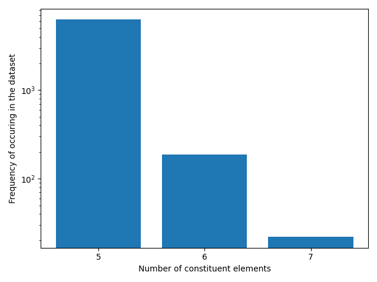
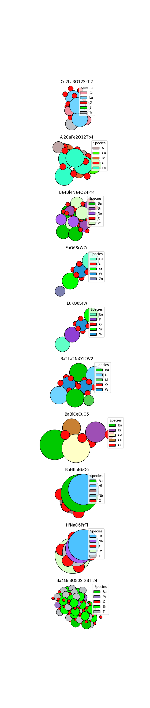
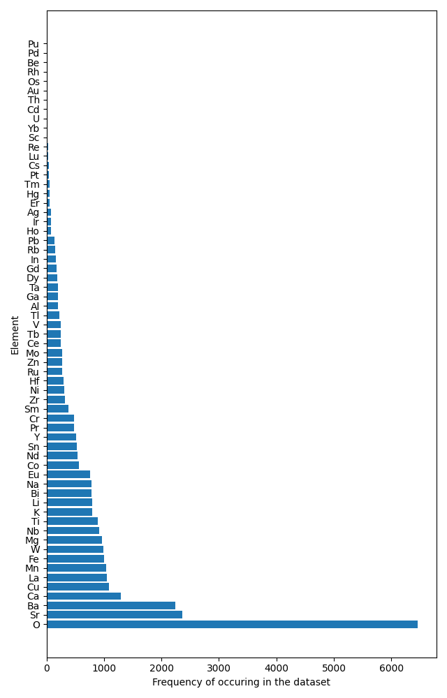
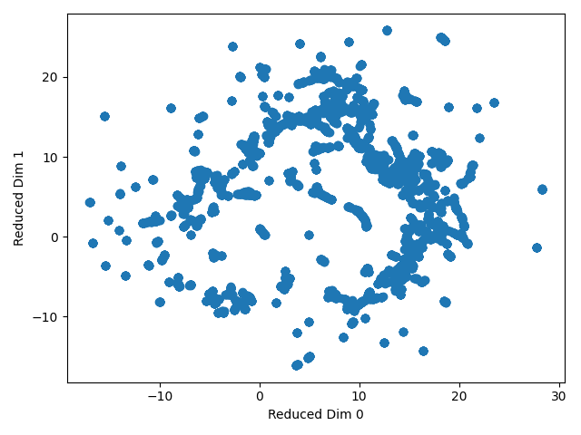
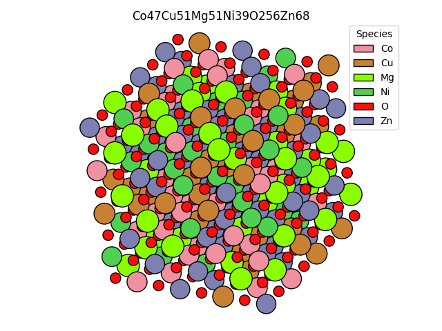

# Finetuning ML Potentials for relaxing high entropy oxides

## Project Overview

Mini-project for application to Dunia Internship - Steffen Wedig

In this mini-project, we finetune a machine learning potential (MACE-MP-0) for relaxation of high entropy oxides (HEOs). Finding stable/ low-energy geometries is important for

- characterising the properties of the bulk material (eg. phonon accuracy, defect energies, )
- determining surface properties (adsorption energies, catalytic activities)

We take three steps to tackle this task:

1. Curate a small dataset of high entropy oxides.
2. Finetune a MACE-MP-0 model on energies and forces
3. Run relaxation starting from randomly substituted crystals


### Dataset Curation

We collect our training dataset from the [LeMaterials Dataset](https://huggingface.co/datasets/LeMaterial/LeMat-Bulk) compiled by Entalpic, which is a combination of QMOD, Alexandria, and the Materials Project.

Simple Definition of HEOs:

- Contains Oxygen,
- Five or more elements,
- All non-oxygen elements are metals

Also filter out data samples out which do not contain forces

Could possibly add more filters:

- Configurational entropy higher then 1.5 R
- Equimolarity of constituent cations
- Remove expensive cations (noble metals e.g. platinum)

We visualize elemental distribution, UMAP projections, and some exemplary structures.

Note that a common definition of high entropy oxides include five different elements in the cations. We relax this definition to five elements in total (i.e. four cations + oxygen) to expand the training set, and argue that structures with four different cationic species also contains valueable information on atomic environments for structures with even larger compositional diversity.

### Finetuning

Finetune MACE-MP-0 using the naive finetuning protocol from the mace torch package, with the default parameters without any kind of hyperparameter optimization/

We essentially ignore catastrophic forgetting, and forego replay finetuning, because replaying the original training data drastically increases the computational cost of finetuning. Further, the LeMaterials dataset contains relevant mp materials anyways, which would be contained in the replay data as well. 

### Relaxation/Evaluation

Compare the energy/force RMSEs for finetuned model

In-distribution eval task: Take the DFT relaxed structures, rattle and relax with MLIP and check the root-mean-square distance (RMSD)/energy difference to the reference.

Out-of-distribution eval task: Start from random substituted parent crystals and relax, and check which model reaches lower energies. However, without performing further DFT, we can't really validate which model  

Compare rate of convergence for both models.

## Installation

Clone this repo, create a python 3.10 env and install required packages via pip

```
git clone git@github.com:steffen-wedig/heo_relax.git
conda create -n heo_relax python==3.10.0
conda activate heo_relax
pip install ./heo_relax
```

Create the dataset by running
```
python scripts/load_data_from_lemat.py
```
Then, modify the training_config.yaml with the absolute paths to the training/ validation dataset on your machine
and subsequently finetune with 

```
mace_run_train --config ./training/finetune_training_config.yaml 
```

Evaluation is run with 
```
python scripts/evaluate_models.py
```


## Results

### Dataset Preparation
Loaded 6463 samples from LeMaterials, with 3514 samples orignally from the Materials Project, 72 rom oqmd, and 2877 from alexandria.

Most samples in the dataset contain 5 elements, i.e 4 metal cations + oxygen. Including these siginficantly expands the training set.



Some sample structures below 


The distribution of elements in the training dataset is quite diverse, with second group alkaline earth metal elements being the most common constituents.




UMAP projection using magpie embeddings shows that the dataset does not really cluster into different splits/classes well. 



### Training


### Evaluation

We evaluate the force and energy error on the test set split. 

Secondly, we relax rock salt structures 4x4x4 supercell structures with randomly substituted cations. The cation species are drawn with probabilities according to their molar ratios in the HEO composition. An exemplary structure is shown below. Note that this means that the composition may not reflect the molar ratios from the formula.




## Outlook

